<div align="center">

# OmniHarness

**The agent harness built for [OmniRoute](https://omniroute.ai).**
Route once, run anywhere — plan, build, research, or turn a swarm loose.

[](https://www.npmjs.com/package/omniharness-cli)
[](https://github.com/shipking-ai/omniharness/actions/workflows/publish.yml)
[](https://nodejs.org)
[](https://go.dev)
[](LICENSE)

<br/>



</div>

---

## Why

If you use OmniRoute, generic coding agents feel slow against it — they were built for one provider and bolt routing on afterward. OmniHarness is the other way round: **OmniRoute is the execution layer, and everything above it is native to that model.** One `provider/model` intent goes out; routing, quota, failover, and provider translation stay where they belong. The harness stays fast on your gateway and still works if you point it somewhere else.

It ships as four front-ends over one core: a terminal UI, a scriptable CLI, a browser view served by
`omniharness serve`, and a desktop window opened by `omniharness desktop`. All of them are clients of the
same HTTP API and the same event stream — `internal/` has no idea a browser exists.

## Install

```bash
npm install -g omniharness-cli
```

```bash
omniharness            # launch the interactive TUI in the current directory
omniharness doctor     # check the gateway connection + auth, safely
omniharness models     # list the routing catalog — combos · auto/* · providers
```

Point it at your gateway (defaults shown):

```bash
export OMNIROUTE_URL=http://127.0.0.1:20128
export OMNIROUTE_API_KEY=sk-…          # Authorization: Bearer, in memory only — never written to disk
export OMNIROUTE_MGMT_TOKEN=sk-…       # optional: exposes OmniRoute's MCP tools to the agent
```

If the key is unset, the TUI asks for it on launch and holds it in memory only. It is redacted from every surface — logs, sessions, telemetry.

## Modes

Cycle with **`Ctrl+E`**. Each reshapes the system frame and what the agent may touch.

| Mode | What it does | Tools | Approvals |
|------|--------------|-------|-----------|
| **plan** | Investigate, name risks, produce a concrete plan | read-only | — |
| **build** | Implement with minimal changes; a mandatory read → change → verify discipline | full | prompts on writes & commands |
| **research** | Answer with evidence from the workspace | read-only | — |
| **crazy** | Fully autonomous. Auto-approves every call, keeps its own todo queue, and once a plan has ≥ 2 independent steps **fans them out across parallel worker agents** | full | auto |

**`Shift+Tab`** cycles a permission mode that is independent of the working mode — **manual** (ask before every write & command), **accept edits** (auto-approve file edits, still ask for commands), **bypass** (auto-approve everything). Crazy mode always runs as bypass.

## The terminal

Everything on screen exists to make agent **intent, action, and history** legible — nothing decorative hides information.

- **Native scrollback is the history.** Settled turns flow straight into your terminal's own buffer; on exit the full plain-text transcript is restored to the primary screen — a real audit trail, no parallel log to maintain.
- **Tear-free streaming** via synchronized output (DECSET 2026), probed at startup alongside the kitty keyboard protocol.
- **Route ribbon.** Every reply is labelled with the provider it actually came from — `via openrouter (failover)` — and failovers land in the transcript as first-class events.
- **Context meter** against the *resolved* model's window, green → amber → red at 70 / 90 %.
- **Per-tool cards** — `$ cmd` with exit-coloured output, `read`, `edit`, unified diffs — collapsed by default, `Ctrl+T` to expand.
- **Scoped-trust approvals** — `y` once · `n` deny · `t` always · pick a scope: exact command → base command → whole tool.
- **Swarm rail** — one lane per parallel worker in crazy mode, coloured by identity, with live progress.
- **Input stays live** during a run: what you type is queued and sent the moment it ends.
- `Ctrl+Y` copies the last reply over OSC 52 (works through SSH); a bell + OSC 9 notification fire when a long run finishes unfocused.
- Session resume, prompt history, `/find`, `/chapters`, and a `Ctrl+L` layout-budget overlay.

<details>
<summary><b>Keys & slash commands</b></summary>

| Key | Action |
|-----|--------|
| `Ctrl+O` | model picker (combos + `auto/*`) |
| `Ctrl+E` | cycle mode |
| `Ctrl+T` | expand / collapse the latest tool card |
| `Ctrl+Y` | copy the last reply to the clipboard |
| `Ctrl+L` | layout-budget overlay |
| `Ctrl+J` | newline (`Shift+Enter` on kitty terminals) |
| `Ctrl+C` | cancel the run, or quit when idle |

`/help` · `/clear` · `/sessions` · `/save <name>` · `/forget <name>` · `/attach <files>` · `/find <text>` · `/chapters`

</details>

## The web view and the desktop window

`omniharness serve` starts a loopback HTTP API and serves a browser view from the same port. Everything it
needs is compiled into the binary — no bundler, no CDN, no webfont — so it draws itself on a machine with no
network, the same promise the TUI makes.

```bash
omniharness serve --port 20140     # http://127.0.0.1:20140/
omniharness desktop                # the same server, opened in its own window
```

`desktop` is not the web view with the tab strip removed. It opens `/desktop`, a surface shaped for a window:

| | |
|---|---|
| **Timeline** | the run on a time axis, built by pairing each opener event with its closer. It answers what a scrollback cannot: where the minutes went, and what ran at the same time as what. |
| **Route** | the same steps as a graph of what actually ran — models, tools and agents as nodes, calls as edges. A node glows while it works and a packet crosses an edge for as long as the call is in flight. |
| **Details** | the whole payload behind any row: the model that answered, tokens, estimated cost, latency. |
| **Sessions** | click one to replay it. Past runs are read back from the store, timeline and all. |
| **Palette** | <kbd>ctrl</kbd>+<kbd>k</kbd> over commands and sessions; `y`/`n` answers a pending approval. |

The window is backed by a Chromium-family browser already on the machine, running app mode against a profile of
its own, so it neither inherits your cookies nor disturbs a browser you already have open. There is no bundled
runtime: Electron would add roughly 150MB to a binary whose whole point is being one file.

Panes are resizable and their sizes persist. A run started anywhere — this window, the TUI, a `curl` against
the API — shows up in all of them, because they all read the same event stream.

### The HTTP API

Every route is bound to loopback and guarded against DNS rebinding: the `Host` header must be a loopback host,
and any `Origin` must be a loopback origin.

| Endpoint | Method | Purpose |
|---|---|---|
| `/health` | GET | version, gateway reachability, auth state |
| `/v1/tasks` | POST | run a task; returns when it finishes |
| `/v1/tasks/{id}/cancel` | POST | cancel one running task by id |
| `/v1/events` | GET | the live event stream (SSE); `?session=` and `?types=` filter it |
| `/v1/event-types` | GET | every event type the runtime can publish |
| `/v1/approvals` | GET | approvals waiting on a decision |
| `/v1/approvals/{id}` | POST | answer one, with `{"granted":true\|false}` |
| `/v1/sessions` | GET | recent sessions |
| `/v1/sessions/{id}` | GET | one session, its tasks and its metrics |
| `/v1/sessions/{id}/events` | GET | that session's stored events, for replay |

`POST /v1/tasks` runs the whole task and answers once, so a client watching a five-minute run needs
`/v1/events` to see anything in between. The SSE `id` field carries the bus publish counter: a gap means the
server dropped events for a client that fell behind, and the session can be re-read to resynchronise.
Delivery is lossy on purpose — a subscriber that blocked the bus would stall the run itself.

Named SSE events only reach listeners that registered for them, which is why `/v1/event-types` exists. A
client that guesses the vocabulary silently misses whole categories of event *and* misreads their sequence
numbers as dropped data.

## Architecture

Two front ends over one core. `internal/gateway` is the **only** place that talks to OmniRoute — swap it for a direct provider or an in-process stub and the whole suite runs offline.

```
  TUI (npm, Ink/React)   CLI (Go, cobra)   web view   desktop window
                    \                 /
             ┌───────────────────────────────┐
             │          core runtime         │   wiring · lifecycle · typed event spine
             └───────────────┬───────────────┘
        task analyzer → strategy → orchestrator → agents
             │          │            │          │
          budget     policy      tools + MCP   evaluate → repair
                                     │
                          model selection (capability-based)
                                     │
                          gateway.Client  ──►  OmniRoute   ← the only boundary
```

The Go side (`internal/**`) carries the orchestration engine and a scriptable CLI:

```bash
omniharness doctor                       # check endpoint + auth, safely
omniharness run "fix the failing test"   # headless, current directory
omniharness stack                        # choose the model combo
omniharness stats                        # spend, tool use and outcomes — by model, tool and strategy
omniharness serve                        # loopback HTTP API + the browser view
omniharness desktop                      # the same harness in its own window
omniharness sessions | models | stats
```

Prebuilt binaries ship with every [release](https://github.com/shipking-ai/omniharness/releases) — linux, macOS and Windows, amd64 and arm64. Download the archive for your platform, or build from a checkout with `go build ./cmd/omniharness`.

Each release carries a `SHA256SUMS` file:

```bash
sha256sum -c SHA256SUMS --ignore-missing
```

Note these are two different programs on a shared version line: `omniharness-cli` on npm is the terminal UI, and the release archives are this Go CLI.

Full write-up: [`docs/architecture.md`](docs/architecture.md).

## Development

```bash
# TypeScript CLI
cd npm && npm install && npm test && npm run build

# Go core
gofmt -l ./cmd ./internal && go vet ./... && go test ./...
```

Every pull request runs [`ci.yml`](.github/workflows/ci.yml) — gofmt, `go vet`, the Go suite, and the TypeScript suite + build — and both checks are required to merge. That is where the Go side is gated. A push to `main` that changes shipped code then runs [`publish.yml`](.github/workflows/publish.yml), which re-runs the TypeScript suite, publishes `omniharness-cli` via npm **trusted publishing (OIDC)** — no token is stored, provenance is attached automatically — then cross-compiles the Go CLI for all six targets and attaches them to a tagged GitHub release with notes generated from that release's commits.

A version number is something people depend on, so documentation, the landing page, tests and workflow edits do not cut one; a commit touching both docs and code still does. To release anyway — a corrected README inside the npm tarball, or a release that failed partway — run the workflow by hand from the Actions tab.

The Go suite is hermetic: tests pin an explicit workspace, so results never depend on whether your checkout has uncommitted changes. Point a run at a different tree with `--workspace` or `OMNIHARNESS_WORKSPACE`.

## License

[MIT](LICENSE)
